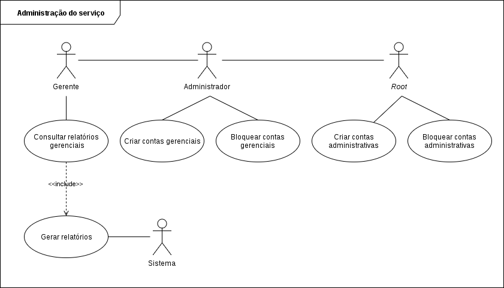

Modelagem
=========

**Atualizado em:** 30/03/2018

Banco de dados
--------------

### Modelo conceitual


### Modelo lógico

```
User (*id, name, email, password, type, remember_token, created_at, updated_at)

Category (* id, category, created_at, updated_at)

Account (* id, account, type, balance, created_at, updated_at, + user_id, + category_id)
	user_id reference User
	category_id reference Category

TrasactionLog (* id, description, value, created_at, updated_at, +source_account_id, +destination_account_id)
	source_account_id reference Account
	destination_account_id reference Account
```

Processo
--------

Caso de uso
-----------

### Caso de uso - 1


### Caso de uso - 2


