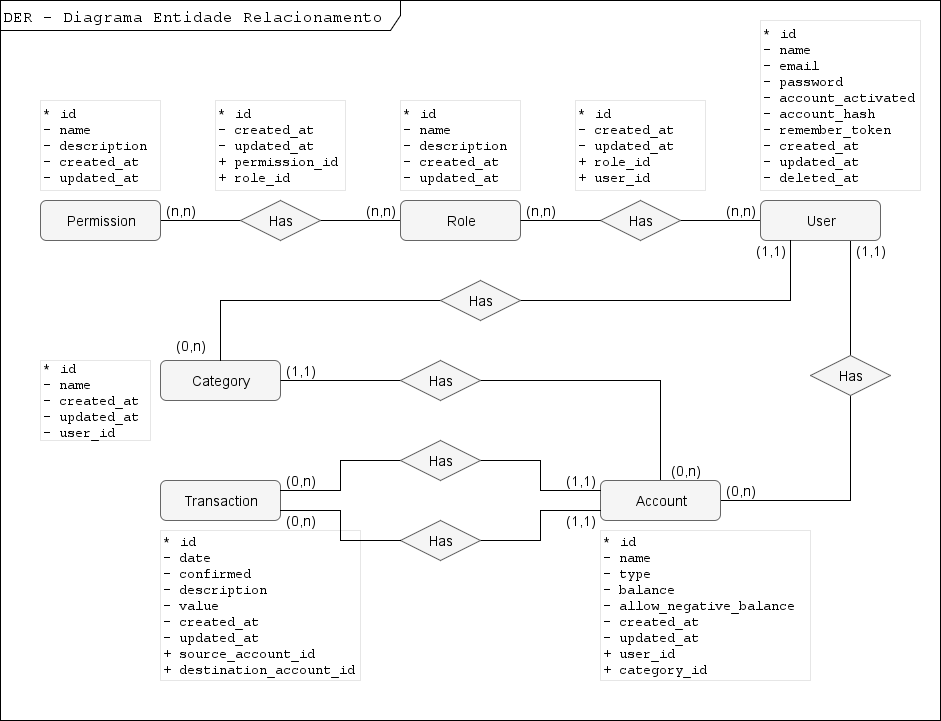
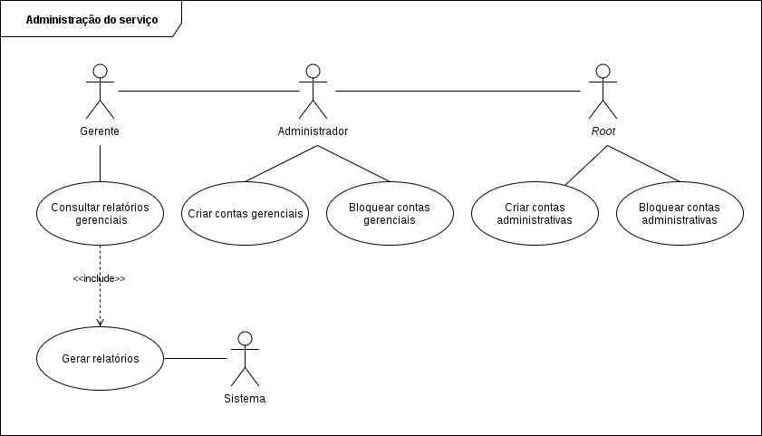

Modelagem
=========

**Atualizado em:** 08/05/2018

Banco de dados
--------------

### Modelo conceitual

Descreve todo o modelo de entidades utilizado para desenvolvimento da versão 1.0.0 da aplicação.



### Modelo lógico

Descreve as tabelas do Banco de Dados da aplicação.

```
Permission (* id, name, description, created_at, updated_at)

Role (* id, name, description, created_at, updated_at)

Permission_Role (* id, created_at, updated_at, + permission_id, + role_id)
	permission_id reference Permission
	role_id reference Role

User (* id, name, email, password, account_activated, account_hash, remember_token, created_at, updated_at, deleted_at)

Role_User (* id, created_at, updated_at, + role_id, + user_id)
	role_id reference Role
	user_id reference User

Category (* id, category, created_at, updated_at, + user_id)
	user_id reference User

Account (* id, account, type, balance, allow_negative_balance, created_at, updated_at, + user_id, + category_id)
	user_id reference User
	category_id reference Category

TrasactionLog (* id, date, confirmed, description, value, created_at, updated_at, +source_account_id, +destination_account_id)
	source_account_id reference Account
	destination_account_id reference Account
```

Caso de uso
-----------

### Caso de uso - 1

Demonstra as funcionalidades disponibilizadas para os usuários do serviço oferecido pela aplicação.


### Caso de uso - 2

Demonstra as funcionalidades disponibilizadas para os administradores de sistema que por ventura possam usar o serviço como negócio.


